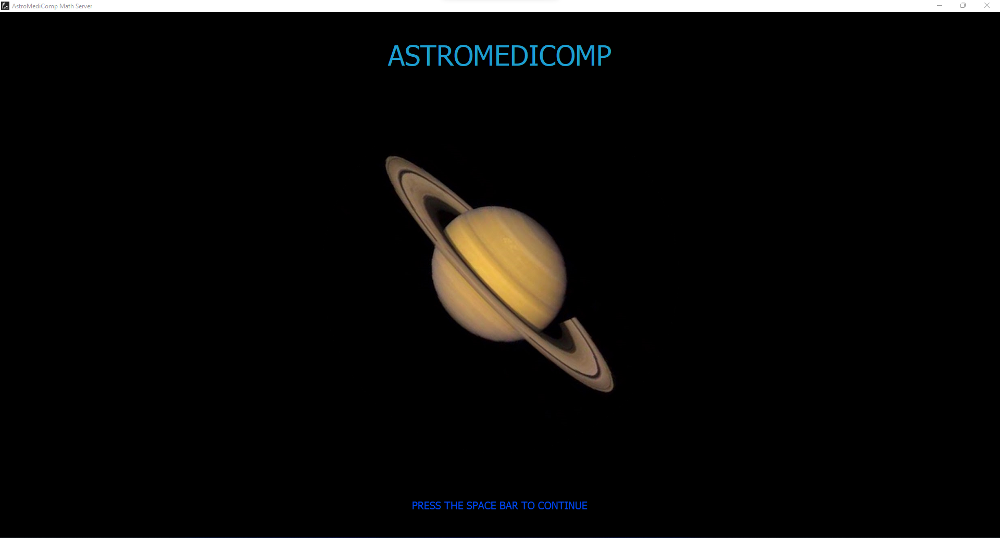
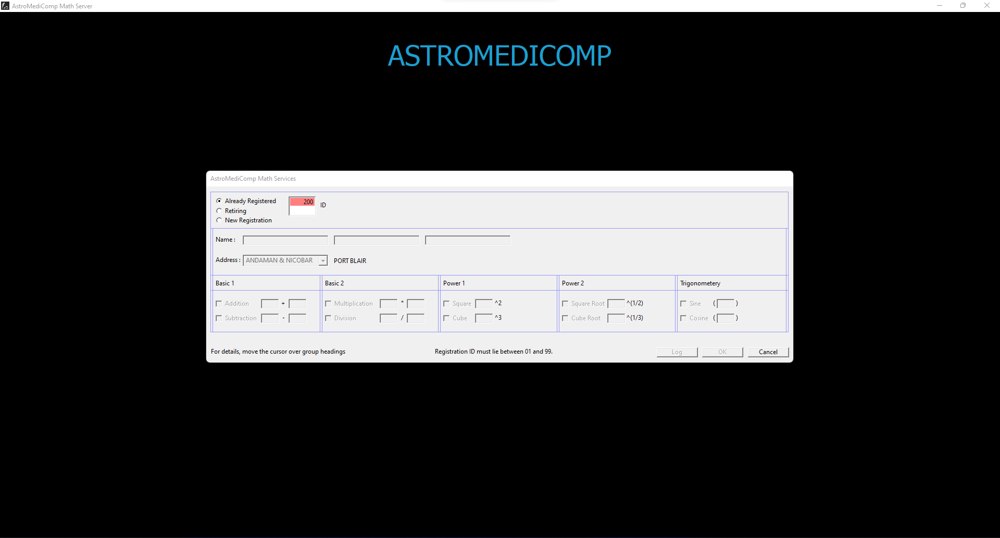
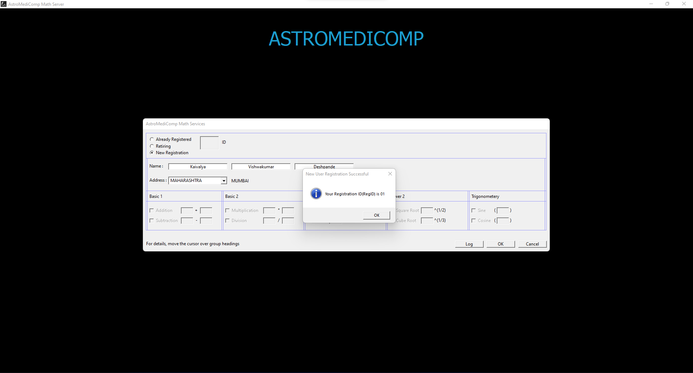
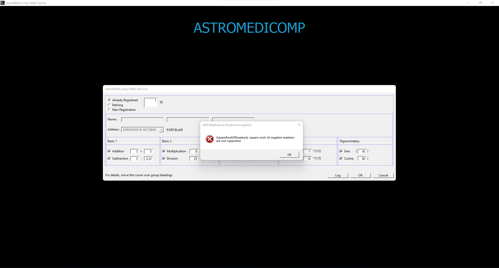
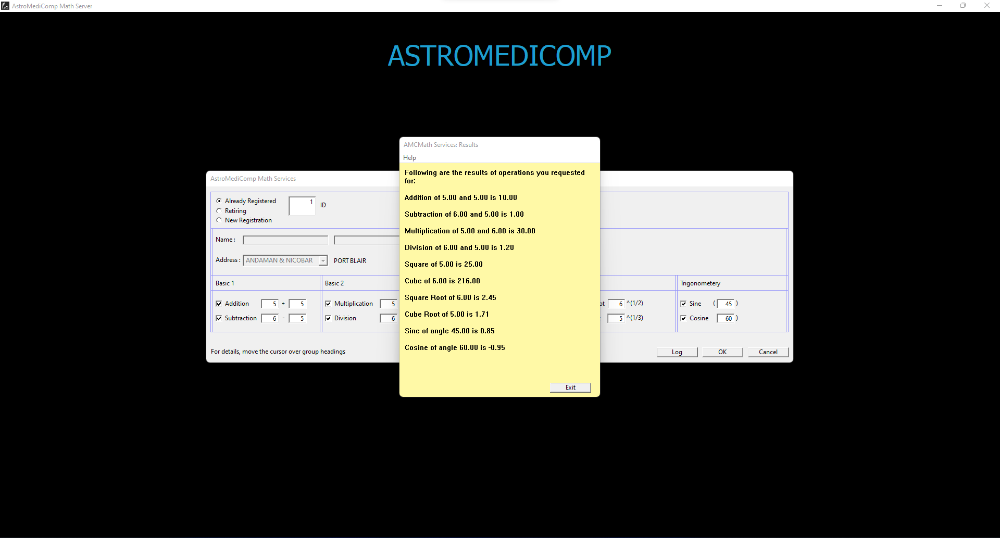
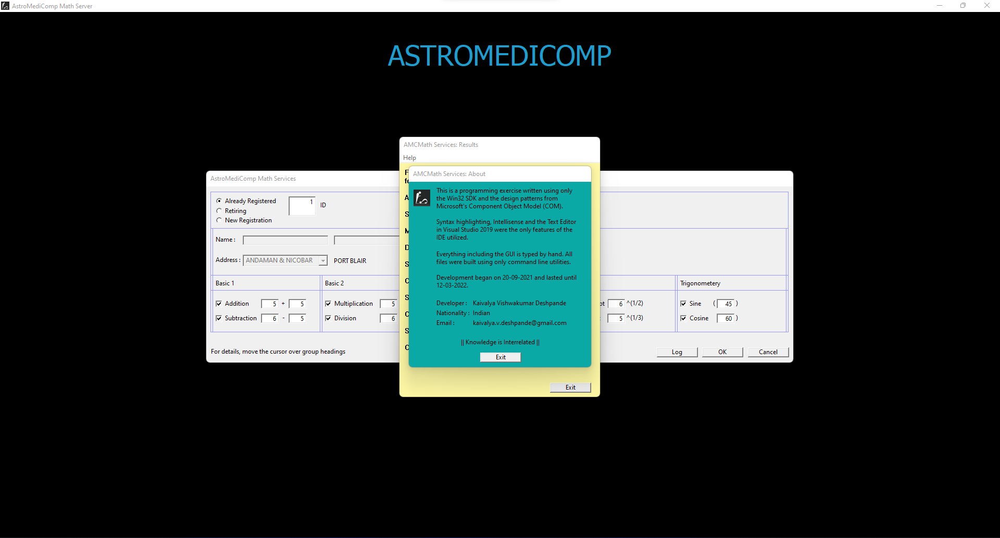
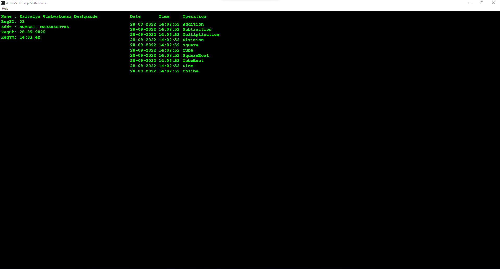
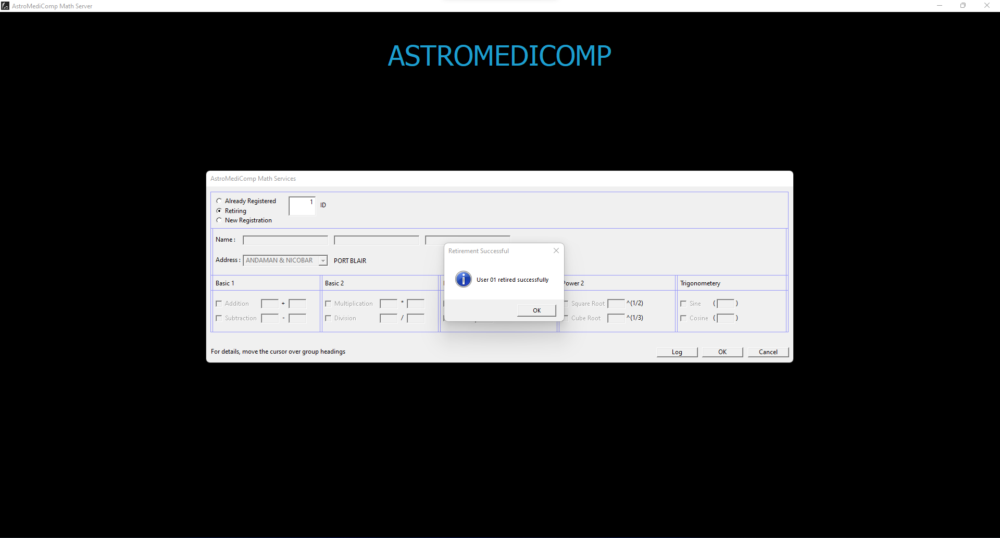
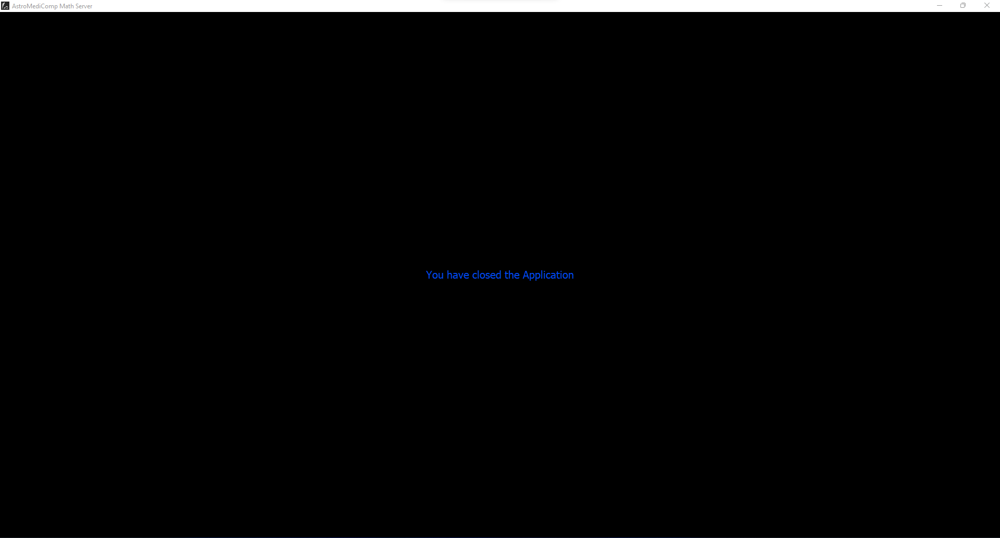

# Welcome to my WinDev2021 Final Project Source Repository!

## About Project:

This is a programming exercise written using only
the Win32 SDK and the design patterns from Microsoft's
Component Object Model (COM). <br />

Syntax highlighting, Intellisense and the Text Editor
in Visual Studio 2019 were the only features of the
IDE utilized.  <br />

Everything including the GUI is typed by hand. All
files were built using only command line utilities.  <br />

Development began on 20-09-2021 and lasted until
12-03-2022.  <br />

Developer:   Kaivalya Vishwakumar Deshpande  <br />
Nationality: Indian  <br />
Email: kaivalya.v.deshpande@gmail.com  <br />

# How To Install:

### Pre-requisites:  <br />
a. You have Visual Studio Command Line Utilities and .NET installed  <br />
b. Your `Windows\` directory exists on the `C:\` drive  <br />

1. Open an Administrative `x64 Native Tools Command Prompt` Instance

2. Build and Install the COM Server by running the following commands
   (`project_dir` is the path to this project's directory):
   
   	```Batchfile
	
   	> cd project_dir\Server
   	> BuildInstallServer.bat  // You would be prompted 2 message boxes after this command, keep clicking OK
   	```

   COM Server is now Built and Installed (Do Not Close the Command Prompt Instance yet)

3. Build and Install the Client by running the following commands: 
	
	```Batchfile
	
	> cd ..\Client
	> BuildInstallClient.bat
	```

   Client has now been Built and Installed.

# How To Run:

Do either of the following:

1. Navigate to `project_dir` in the file explorer and double-click on `AMCMathServices.exe`; or

2. Navigate to `project_dir` in a command prompt instance, and run the following command:

	```Batchfile
	
	> AMCMathServices.exe
	```

# How To Uninstall:

1. Open an Administrative `x64 Native Tools Command Prompt` Instance

2. Uninstall the Client by running the following commands
   (`project_dir` is the path to this project's directory):

	```Batchfile
	
	> cd project_dir\Client
	> UninstallClient.bat
	```

   Client has now been Uninstalled (Do Not Close the Command Prompt Instance yet)

3. Uninstall the COM Server by running the following commands:
   	
	```Batchfile
	
	> cd ..\Server
	> UninstallServer.bat  // You would be prompted 2 message boxes after this command, keep clicking OK
	```

   COM Server has now been Uninstalled.

## Previews


<p aligh="center"> What you see when you run the Application </p>  <br />


All errors are validated on the spot  <br />


Upon Successful Registration  <br />


Non-Real Numbers or NaNs are Not Supported by the Server  <br />


The Results Dialog  <br />


The About Dialog  <br />


The Splash Window can become a Display for the User Log  <br />


Upon Successful Retirement  <br />


What you see when you close the Application  <br />

## Enjoy!
